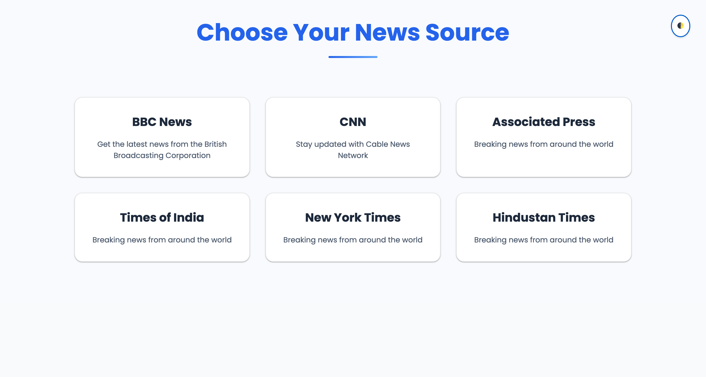
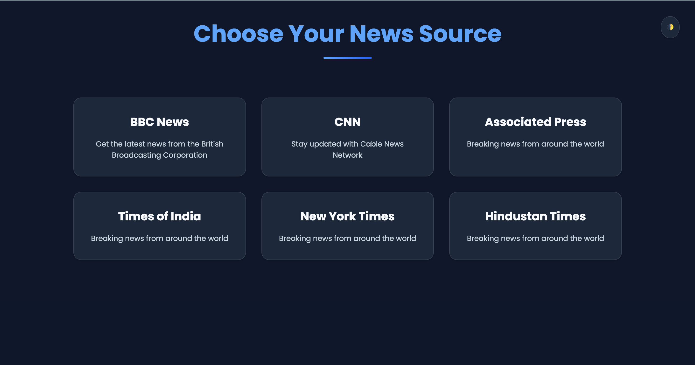

# ChronoSphere: Dynamic News Aggregator Engine

A responsive and user-friendly news aggregator built with Flask and web scraping techniques. It allows users to explore headlines from various popular news sources.

**Features:**

-   **News Source Selection:** Choose from a curated list of reputable news outlets like BBC, CNN, AP, Times of India, New York Times, and Hindustan Times.
-   **Headline Display:** Selected news sources are scraped to extract headlines, presented in a clean and readable format.
-   **Responsive Design:** Adapts seamlessly to different screen sizes, ensuring optimal user experience on desktops, tablets, and mobile devices.
-   **Dark Theme:** Users can switch between light and dark themes for better readability.

**Theme Switching:**

The News Mania features a dynamic theme switching functionality, allowing users to choose between a light and a dark color scheme. The selected theme is saved to local storage, so the user's preference is remembered across sessions.

**Light Mode:**



**Dark Mode:**



**Technologies:**

-   **Backend:** Flask (Python web framework)
-   **Web Scraping:** Beautiful Soup 4 (HTML parsing and data extraction)
-   **User-Agent Simulation:** fake-useragent (prevents website blocking)

**Project Structure:**

```
The News Mania/
├── app.py                  # Flask application code
├── templates/
│   ├── index.html           # Main page (news source selection)
│   └── news.html            # Page displaying headlines for a source
├── static/
│   ├── css/
│   │   ├── common.css       # Shared styles
│   │   ├── index.css        # Main page styles
│   │   └── news.css         # Headline page styles
│   │   ├── index.css        # Main page styles
│   │   └── variable.css     # Global color variables
│   ├── js/
│   │   └── theme.js         # JavaScript for theme toggle functionality
│   │

```

**Running the Project:**

1.  **Install Dependencies:**
    ```bash
    pip install Flask requests beautifulsoup4 fake-useragent
    ```

2.  **Ensure Python 3 and pip are installed.**
3.  **Open a terminal and navigate to the project directory.**
4.  **Run the application:**
    ```bash
    python app.py
    ```

5.  **Access the application in your web browser at http://127.0.0.1:5000/ (or your local development server address).**

**CSS Structure:**

The project uses a modular CSS structure for maintainability:

-   `variables.css`: Defines CSS variables for colors, shadows, etc., making theme switching easy.
-   `common.css`: Contains styles shared across all pages, like basic resets, body styles, and the theme toggle.
-   `index.css`: Styles specific to the main page (`index.html`), including the news source grid.
-   `news.css`: Styles specific to the headlines page (`news.html`), including headline display and the back link.

**Contributing:**

I welcome contributions to enhance The News Mania! Here are some ways to participate:

-   Report bugs and suggest improvements.
-   Help add new news source support.
-   Improve the design and user interface.
-   Fork the repository and create pull requests with your contributions.
